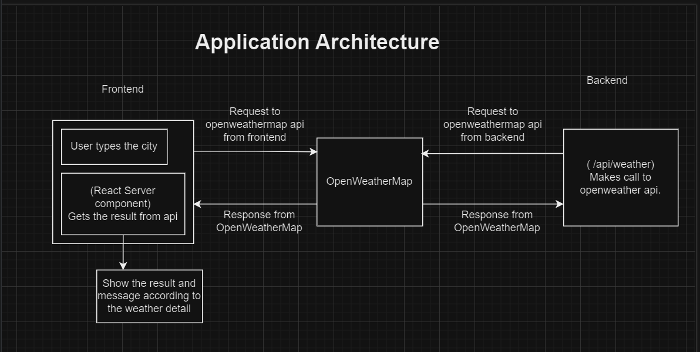
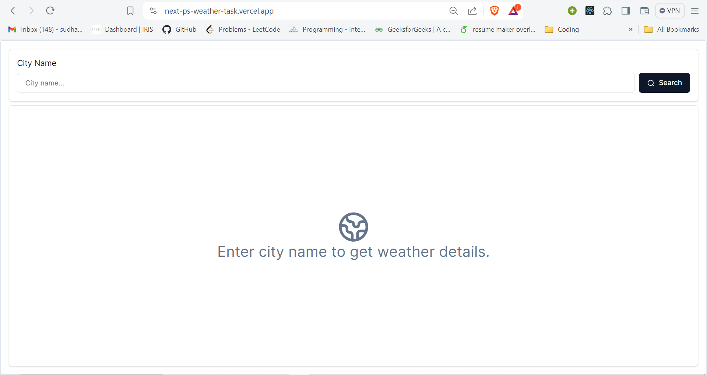
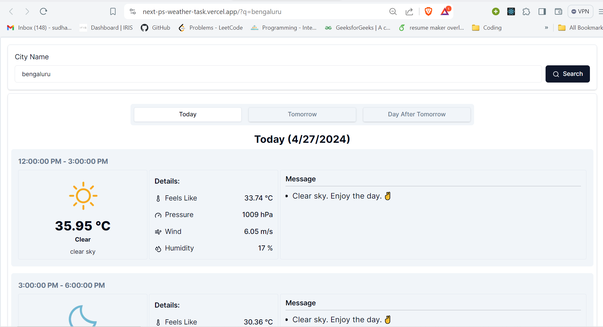
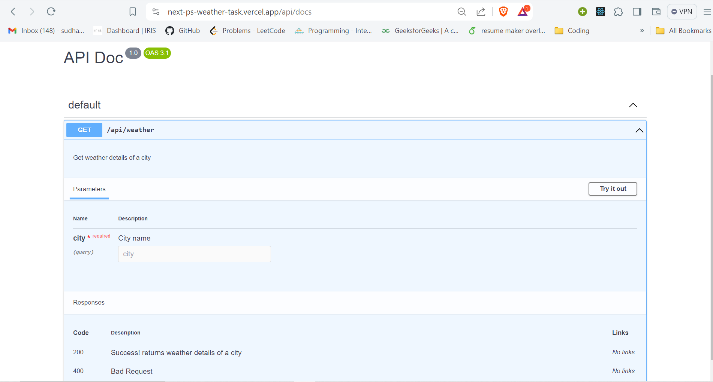
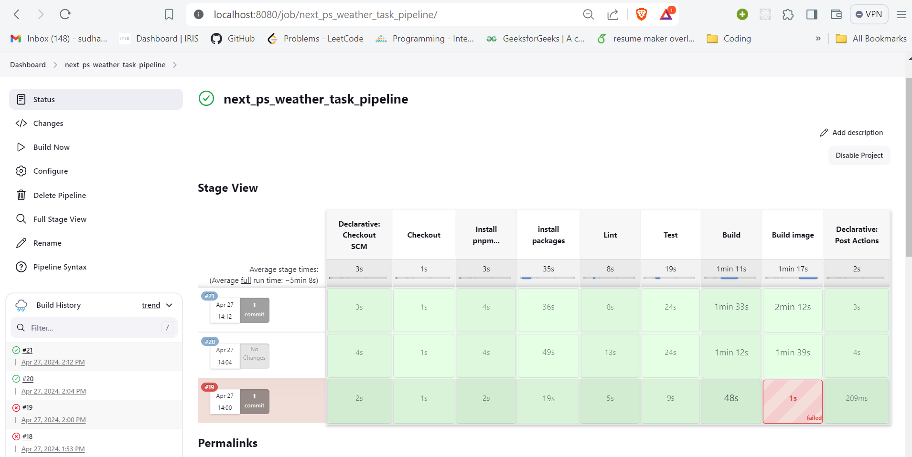
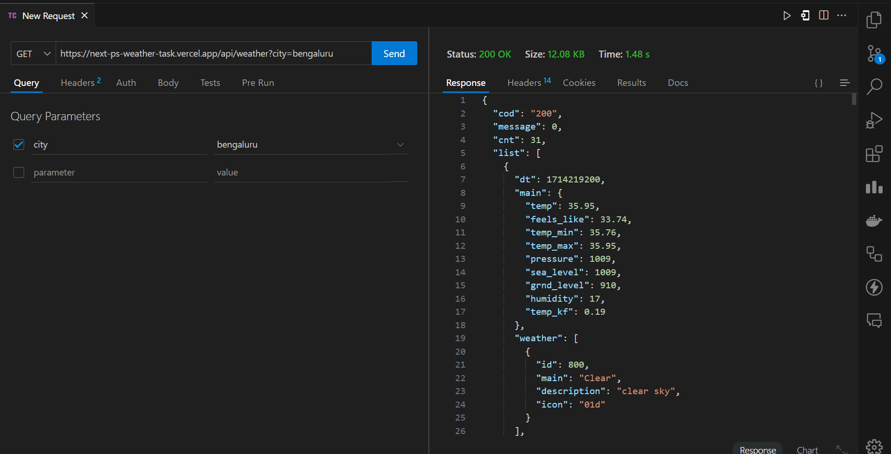

# Publicis Sapients Assignment (Full Stack – UI, Service + CI/CD)

## Weather App:

### Features:
- User can search for a city and get the weather data.
- User can get the weather data of 3 days (Today, Tomorrow and Day after tomorrow) of a city with Prediction on every 3 hour window.

### Tech Stack:
- Frontend: ReactJS + NextJs
- Backend: NextJs
- CI/CD: Jenkins, Docker
- Deployment: Vercel
- Api Documentation: OpenApi/Swagger

### Application Architecture


### Explanation: 
- When user lands on the home page he sees the form to type the city name and search for the weather data.
- When user types the city name and clicks on search, the frontend sends a GET request to the openWeatherMap api and renders the result.
- Since nextjs supports server side rendering, we dont have to worry about the apikey exposing on the client and also nextjs allows caching the request we will revalidate the request every 3 hour. (Performance Optimization & Security aspects)
- We can get the data from Postman or Thunderclinet by sending a GET request to http://localhost:3000/api/weather?city={city_name} and It sends the request to the openWeatherMap api and returns the data.
- Since both the requests are happening on the server we dont have to worry about the apikey exposing on the client side. (Sensitive information used in the Micro Services such as API keys are protected)

## Demo Pictures
- Home Page
    
- Query Page (All the weather data of a city with Prediction on every 3 hour window)
    
- Api docs
    
- Jenkins Pipeline
    
- Postman Api request
    

## How to run the project
- Clone the repository
    ```bash
    git clone https://github.com/Sudhanva-Nadiger/next_ps_weather_task.git
    ```
- Requirements
    - NodeJs
    - pnpm
    ```bash
    npm install -g pnpm
    ```

- Install the dependencies
    ```bash
    cd next_ps_weather_task
    pnpm install
    ```
- Run the project
    ```bash
    pnpm dev
    ```
    - Open the browser and go to http://localhost:3000 to see the ui in the browser.
    - Test api in Postman or Thunderclinet by sending a GET request to http://localhost:3000/api/weather?city={city_name}
    - Api docs at: http://localhost:3000/api/docs

- Run tests
    ```bash
    pnpm test
    ```

## CI/CD
- Jenkins Pipeline
    - Jenkinsfile is present in the root directory of the project.
    - Jenkins pipeline is configured to check linting, run tests and build and build docker image.

- Docker
    - Dockerfiles are present in the root directory of the project to build the docker image.You can easily run the project using docker without any dependencies.

## Deployment
- Deployed on Vercel (Production readiness of the code).
    - Frontend: https://next-ps-weather-task.vercel.app/
    - Backend: https://next-ps-weather-task.vercel.app/api/weather (For more information check the api documentation at https://next-ps-weather-task.vercel.app/api/docs)
